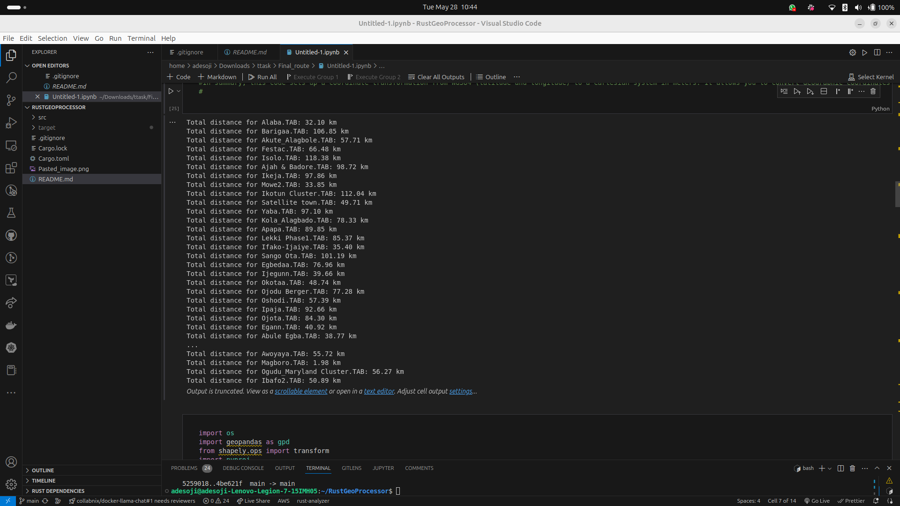

# Total Distance Calculator for .TAB Files

This project calculates the total distance of geographic features in MapInfo `.TAB` files. The calculation is performed using the `geopandas`, `shapely`, and `pyproj` libraries in Python. The script reads the `.TAB` files, transforms the coordinate system to accurately measure distances in meters, and then converts the total distance to kilometers.

## Requirements

- Python 3.x
- geopandas
- shapely
- pyproj

## Installation

1. Clone this repository:

    ```sh
    git clone git@github.com:Adesoji1/RustGeoProcessor.git
    cd RustGeoProcessor
    ```

2. Create a virtual environment (optional but recommended):

    ```sh
    python -m venv venv
    source venv/bin/activate  # On Windows use `venv\Scripts\activate`
    ```

3. Install the required Python packages:

    ```sh
    pip install geopandas shapely pyproj
    ```

## Usage

1. Place your `.TAB` files in the specified directory. By default, the script looks for files in `/home/adesoji/Downloads/spectranet_task/Final_route`. You can change this directory path in the script as needed.

2. Run the script:

    ```sh
    python calculate_distance.py
    ```

   The script will loop through all `.TAB` files in the directory, calculate the total distance for each file, and print the results.

## Script Details

The main script `calculate_distance.py` performs the following steps:

1. Reads the `.TAB` file into a GeoDataFrame using `geopandas`.
2. Ensures the GeoDataFrame is in the WGS84 coordinate system (latitude and longitude).
3. Defines a projection to meters using the World Equidistant Cylindrical (EPSG:4087) coordinate system for accurate distance measurement.
4. Transforms the line geometries from degrees to meters and calculates the total distance.
5. Converts the total distance from meters to kilometers and prints the result.

Here is the script for reference:

```python
import os
import geopandas as gpd
from shapely.ops import transform
import pyproj

def calculate_total_distance_km(tab_file_path):
    # Load the .tab file
    gdf = gpd.read_file(tab_file_path)

    # Ensure the GeoDataFrame is in WGS84 (latitude and longitude)
    gdf = gdf.to_crs('EPSG:4326')
   
    # Define a projection to meters (using World Equidistant Cylindrical, EPSG:4087)
    # to accurately measure distances
    project = pyproj.Transformer.from_crs(
        'EPSG:4326', # Source coordinate system (WGS84)
        'EPSG:4087', # Destination coordinate system (meters)
        always_xy=True
    ).transform
   
    # Calculate total distance by converting line lengths from degrees to meters
    total_distance_meters = gdf.geometry.apply(lambda geom: transform(project, geom).length).sum()

    # Convert meters to kilometers
    total_distance_km = total_distance_meters / 1000

    return total_distance_km

# Directory containing your .tab files
directory_path = '/home/adesoji/Downloads/spectranet_task/Final_route'

# Loop through all .tab files in the directory and calculate total distances
for filename in os.listdir(directory_path):
    if filename.endswith('.TAB'):
        tab_file_path = os.path.join(directory_path, filename)
        total_distance_km = calculate_total_distance_km(tab_file_path)
        print(f"Total distance for {filename}: {total_distance_km:.2f} km")
```


## Troubleshooting

- **File Not Found Error**: Ensure the directory path and file names are correct.
- **Missing Packages**: Install the required packages using `pip install geopandas shapely pyproj`.

## License

This project is licensed under the MIT License.

## Contributing

Contributions are welcome! Please submit a pull request or open an issue for any improvements or bug fixes.

## Acknowledgments

- [geopandas](https://geopandas.org/)
- [shapely](https://shapely.readthedocs.io/)
- [pyproj](https://pyproj4.github.io/pyproj/stable/)

