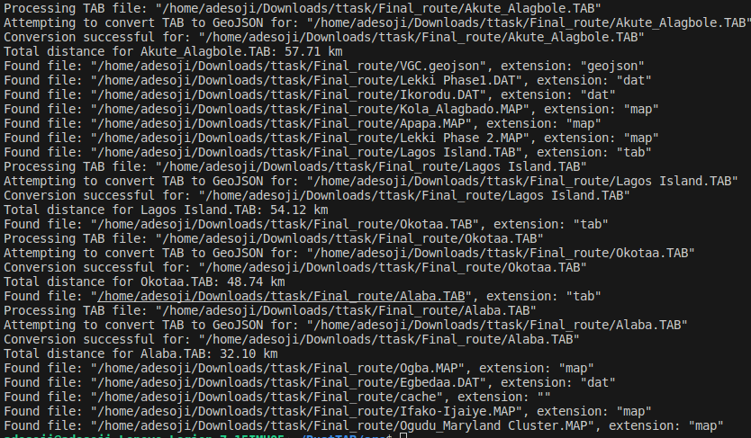

# 🌍 GeoData Transformer

This Rust project automates the transformation of MapInfo TAB files into GeoJSON format and calculates the total Euclidean distance of line strings within these files. This tool is invaluable for GIS professionals looking to streamline their data workflows across different platforms.

## 🚀 Features

- **File Conversion**: Convert MapInfo TAB files to the more accessible GeoJSON format.
- **Distance Calculation**: Automatically calculate and report the total distance of line strings in the GeoJSON file.
- **High Performance**: Leverages Rust's performance to handle large datasets efficiently.

## 🛠️ Installation

Ensure you have Rust and Cargo installed on your machine. You will also need GDAL installed, as it is required for the `ogr2ogr` command-line tool used in file conversions. look up the dependencies  [here](Cargo.toml)

### Step 1: Clone the Repository

```bash
git clone https://github.com/Adesoji1/RustGeoProcessor.git
cd /RustGeoProcessor
```

### Step 2: Build the Project

```bash
cargo build --release
```

## 🔧 Usage

To run the program, navigate to the project directory and use the following command:

```bash
cargo run
```

The program will process all TAB files in the specified directory (update the directory path in the main function as needed) as you can see here below.

## 📄 Example

After running the program, you should see output in the console similar to:

```bash
Reading directory: "/path/to/your/directory"
Found file: "example.TAB", extension: "tab"
Processing TAB file: "example.TAB"
Conversion successful for: "example.TAB"
Total distance for example.TAB: 34.56 km
```



## 🛠 Configuration

You can modify the path to the directory containing the TAB files directly in the `main.rs` file:

```rust
let directory_path = Path::new("/path/to/your/directory");
```

## 📦 Dependencies

- `geo`: For geometric calculations.
- `geojson`: For handling GeoJSON data formats.
- `proj`: For coordinate projections and transformations.
- `std::process`: For invoking external commands.

## 🤝 Contributing

Contributions are what make the open-source community such an amazing place to learn, inspire, and create. Any contributions you make are **greatly appreciated**.Future work will be to build an application around this completely in rust

1. Fork the Project
2. Create your Feature Branch (`git checkout -b feature/AmazingFeature`)
3. Commit your Changes (`git commit -m 'Add some AmazingFeature'`)
4. Push to the Branch (`git push origin feature/AmazingFeature`)
5. Open a Pull Request

## ⚖️ License

Distributed under the MIT License. See `LICENSE` for more information.

## 📬 Contact

Your Name - [@aealu](https://twitter.com/aealu) - <adesoji.alu@gmail.com>

Project Link: [Rustgeoprocessor](https://github.com/Adesoji1/RustGeoProcessor)


